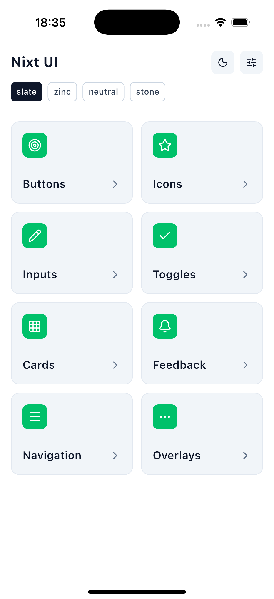
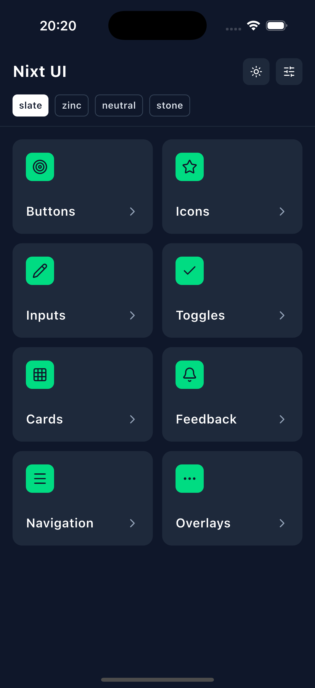
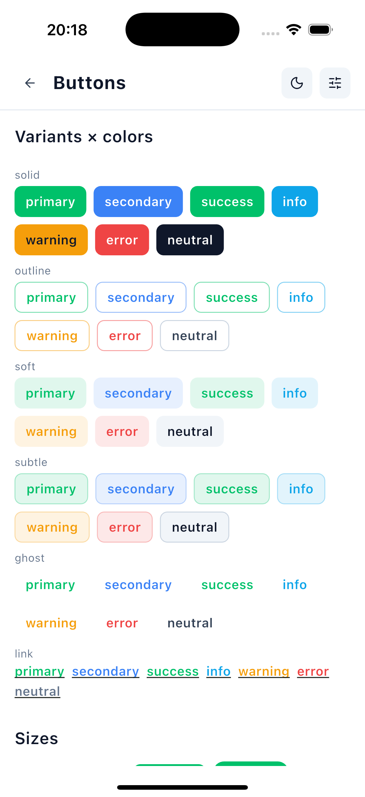
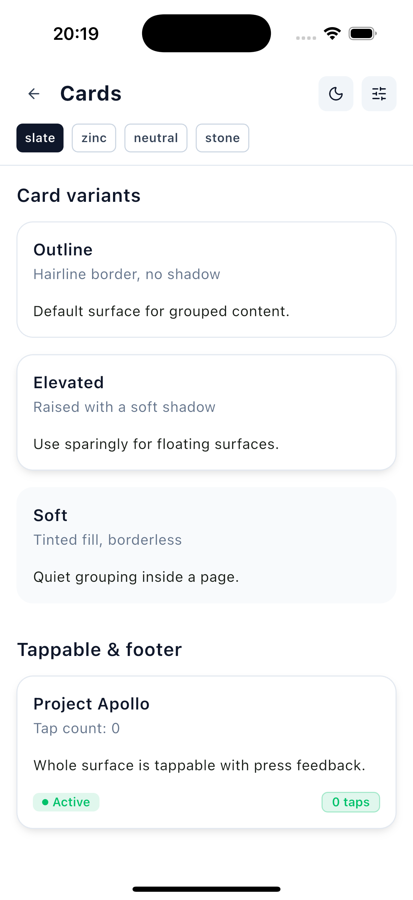
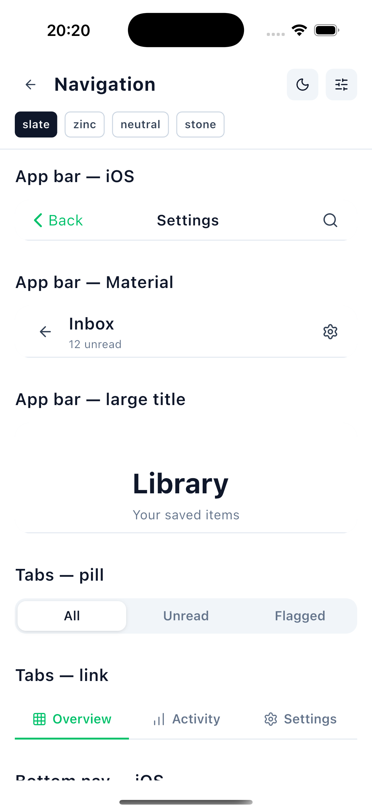

# Nixt UI

A faithful Flutter port of the **Nuxt UI v4 mobile design system** — signature
green `#00DC82`, built for native iOS & Android. Themeable through Flutter's
`ThemeExtension`, dark-mode aware, and **zero third-party dependencies** (Flutter
SDK + Dart only).

- 🎨 **3-layer token model** — palette → semantic colors → theme. 7 semantic
  roles (primary / secondary / success / info / warning / error / neutral),
  switchable neutral palettes (slate / zinc / neutral / stone), single-token
  radius scale.
- 🌗 **Light & dark** out of the box, plus per-app brand-color overrides.
- 🧩 **45+ components** across buttons, forms, data, feedback, navigation and
  overlays — each a typed, purely-visual widget (no navigation or global state).
- 🔤 **Bundled fonts** — Poppins, JetBrains Mono, and the full Lucide icon set
  (1,986 glyphs).
- 📱 iOS- and Material-flavored variants where it matters (app bars, tabs,
  bottom nav, action sheets, toasts).

> Minimum: Flutter 3.19 / Dart 3.3.

## Screenshots

From the [`example/`](example/) gallery (iPhone 16 Pro):

<p align="center">
  
  
  
</p>
<p align="center">
  
  
</p>

## Install

```yaml
dependencies:
  nixt_ui: ^0.3.0
```

```dart
import 'package:nixt_ui/nixt_ui.dart';
```

## Quick start

Use `NixtApp` — a drop-in replacement for `MaterialApp` that wires the whole
design system in one place. It accepts **every** `MaterialApp` property.

```dart
import 'package:flutter/material.dart';
import 'package:nixt_ui/nixt_ui.dart';

void main() => runApp(const MyApp());

class MyApp extends StatelessWidget {
  const MyApp({super.key});

  @override
  Widget build(BuildContext context) {
    return NixtApp(
      title: 'My App',
      // DS configuration applied to every component:
      neutral: NixtNeutral.zinc,
      radius: const NixtRadius(base: 12),
      roles: {
        NixtColorRole.primary: NixtColorScale.fromSeed(const Color(0xFF8B5CF6)),
      },
      home: const HomeScreen(),
    );
  }
}
```

Already using `MaterialApp`? Just register the theme extension:

```dart
MaterialApp(
  theme: ThemeData(extensions: [NixtTheme.light()]),
  darkTheme: ThemeData(extensions: [NixtTheme.dark()]),
);
```

Read the theme anywhere with `NixtTheme.of(context)` or `context.nixt`.

## Components

```dart
// Buttons
NixtButton(label: 'Save', icon: NixtIcons.check, onPressed: () {});
NixtIconButton(icon: NixtIcons.heart, label: 'Like', onPressed: () {});
NixtFab(icon: NixtIcons.plus, onPressed: () {});

// Forms
NixtInput(hintText: 'Email', icon: NixtIcons.mail);
NixtSelect(items: items, value: v, onChanged: (x) {});
NixtCheckbox(value: on, label: 'Accept', onChanged: (x) {});
NixtSlider(value: 60, onChanged: (x) {});

// Data
NixtCard(title: 'Storage', subtitle: '78% used', child: ...);
NixtBadge(label: 'New', color: NixtColorRole.success);
NixtAvatar(name: 'Ada Lovelace', status: NixtAvatarStatus.online);
NixtProgress(value: 64, showValue: true);

// Feedback
NixtAlert(title: 'Saved', color: NixtColorRole.success);
NixtToast(message: 'Link copied');
NixtSkeleton(variant: NixtSkeletonVariant.text, lines: 3);

// Navigation
NixtAppBar(title: 'Settings', onBack: () {});
NixtTabs<String>(value: tab, onChanged: (x) {}, items: tabs);
NixtBottomNav<int>(value: i, onChanged: (x) {}, items: dests);

// Overlays
showNixtSheet(context: context, builder: (_) => ...);
showNixtDialog(context: context, title: 'Delete?', actions: [...]);
showNixtActionSheet(context: context, actions: [...]);
NixtMenu(trigger: ..., items: [...]);
```

| Group | Components |
|-------|-----------|
| **Buttons** | `NixtButton`, `NixtIconButton`, `NixtFab` |
| **Icon** | `NixtIcon` (+ `NixtIcons`, 1,986 Lucide glyphs) |
| **Forms** | `NixtInput`, `NixtTextarea`, `NixtSelect`, `NixtMultiSelect`, `NixtCheckbox`, `NixtRadio`, `NixtSwitch`, `NixtSlider`, `NixtStepper`, `NixtRating`, `NixtPinInput`, `NixtSearchBar`, `NixtCalendar`, `NixtNumberPad` |
| **Data** | `NixtCard`, `NixtBadge`, `NixtChip`, `NixtDivider`, `NixtProgress`, `NixtAvatar`, `NixtAvatarGroup`, `NixtListItem`, `NixtAccordion`, `NixtStat`, `NixtTimeline`, `NixtCarousel` |
| **Feedback** | `NixtAlert`, `NixtEmptyState`, `NixtSkeleton`, `NixtToast`, `NixtSpinner` |
| **Navigation** | `NixtAppBar`, `NixtBottomNav`, `NixtTabs`, `NixtPageIndicator`, `NixtSteps` |
| **Overlay** | `showNixtSheet`, `showNixtActionSheet`, `showNixtDialog`, `NixtMenu` |

## Theming

Every visual surface resolves from the active `NixtTheme`:

```dart
final c = context.nixt.colors;       // semantic colors (bg, text, border, roles…)
final r = context.nixt.radius;       // radius scale
final s = context.nixt.shadows;      // elevation set
```

Override a brand color globally with a single seed — tints and variants derive
automatically:

```dart
NixtApp(
  roles: {NixtColorRole.primary: NixtColorScale.fromSeed(Color(0xFF8B5CF6))},
  ...
);
```

## Example

A full component gallery lives in [`example/`](example/) (web + iOS). Run it:

```sh
cd example
flutter run
```

## License

[MIT](LICENSE). Bundled fonts ship under their own licenses (SIL OFL for
Poppins & JetBrains Mono, ISC for Lucide) — see `assets/fonts/`.
